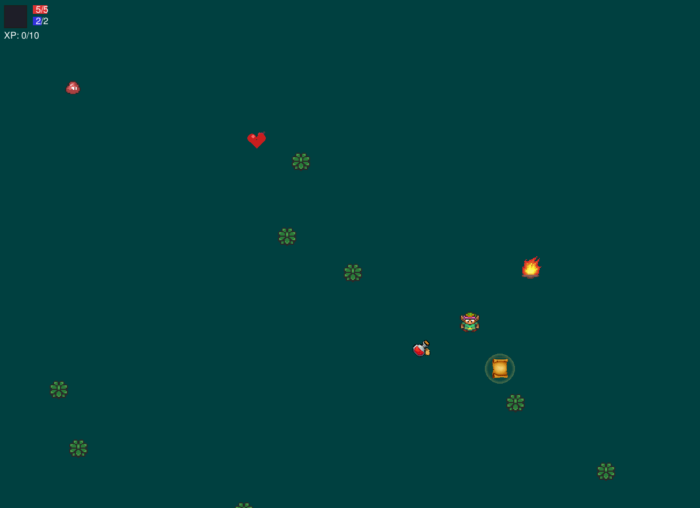
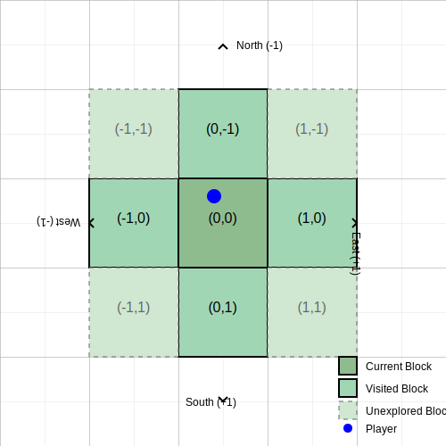

# The Dark Garden of Z

A 2D action-adventure game with procedural world generation, RPG-inspired character progression, and dynamic combat mechanics. Available in both Python/Pygame and JavaScript/HTML5 Canvas versions.



## Platforms

| Version | Technology | Status |
|---------|------------|--------|
| Desktop | Python / Pygame | Complete |
| Web | JavaScript / HTML5 Canvas | Complete |

---

## Key Features

### Player System
- **Attribute System**: Level up to increase STR, CON, DEX, and INT stats that affect combat and movement
- **Skill Tree**: Three branches (Mind, Body, Magic Sword) with unlockable abilities
- **Abilities**:
  - **Dash**: Temporary speed boost (SHIFT)
  - **Blink**: Short-range teleportation (B)
  - **Firebolt**: Ranged magic attack (F)
  - **Extended Sword**: Increased attack reach
- **Character Screen**: View stats, allocate points, manage inventory (ENTER)
- **Inventory System**: Collect and use items (health potions, progression items)

### Experience System
- **Progressive Difficulty**: XP requirements scale exponentially
- **Dynamic XP Tables**: Find special items to modify XP scaling:
  - **Ancient Scroll**: Reduces XP scaling from 1.5x to 1.3x
  - **Dragon Heart**: Further reduces scaling to 1.2x
- **Soul Collection**: Defeat enemies to collect souls that provide XP

### Enemy System
- **Enemy Types**: Slimes and Skeletons with unique behaviors
- **Attribute-Based**: Enemies have STR, CON, DEX, and INT
- **Difficulty Scaling**: Enemies become harder based on distance from origin
- **AI Behaviors**: Detection, chasing, and attack patterns
- **Visual Feedback**: Hit animations, knockback, and death particles

### World System
- **Infinite Procedural Generation**: World expands as you explore
- **Block Persistence**: Each area maintains its state when revisited
- **Safe Spawning**: Entry points are cleared of obstacles
- **Difficulty Progression**: Tougher enemies further from origin
- **Transition Effects**: Smooth fading between world blocks
- **Environment Objects**: Grass, rocks, and bonfires



### Combat System
- **Directional Attacks**: Sword swings with hitbox detection
- **Knockback Physics**: Physical reactions to attacks
- **Damage Calculation**: Based on STR vs CON
- **Invulnerability Frames**: Brief protection after taking damage
- **Projectiles**: Firebolt spell with particle effects

### Save/Load System
- **Bonfire Rest Points**: Interact to heal and access save menu
- **Multiple Save Slots**: Create and manage save files
- **Full State Persistence**: Position, stats, skills, inventory, and progression

### NPCs & Dialog
- **Interactive NPCs**: Talk to characters for hints and help
- **Dialog Balloons**: Speech bubbles with NPC dialogue
- **LinkNPC**: Helpful character that can heal and share wisdom

### Death & Respawn
- **Death Screen**: "YOU DIED" overlay with options
- **Restart**: Begin a new game
- **Load Save**: Return to a previous save point

---

## Controls

| Action | Keyboard | Gamepad |
|--------|----------|---------|
| Movement | WASD / Arrow Keys | Left Stick / D-Pad |
| Attack | SPACE | A / X |
| Interact | E | B / Circle |
| Dash | SHIFT | LB / L1 |
| Blink | B | RB / R1 |
| Firebolt | F | Y / Triangle |
| Character Screen | ENTER | Start |
| Map Toggle | M | Select |
| Debug Collisions | C (hold) | - |
| Debug Enemy Info | F3 | - |
| Add XP (debug) | + | - |

---

## Getting Started

### JavaScript/HTML5 Version (Web)

#### Prerequisites
- Any modern web browser (Chrome, Firefox, Safari, Edge)
- Local web server (for development)

#### Run the Game
```bash
python -m http.server 8000
# Or: npx serve .
